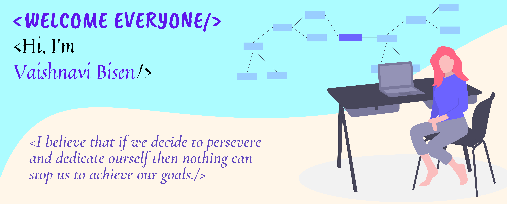

<h1 align="center"></h1>

## 🙋‍♂️ About Me

- 🔭 I’m currently working on **MERN STACK & FLUTTER DEVELOPMENT**

- 👯 I’m looking to collaborate on **OpenSource Projects**

## 🚀 Languages and Tools:

                   

<!--       -->
 

    

## 📊 My Github Stats

   
    
  
   
  <b>Note:</b> Top languages is only a metric of the languages my public code consists of and doesn't reflect experience or skill level.

 
 

 
 

## Connect with me:

## ❤ Views and Followers

